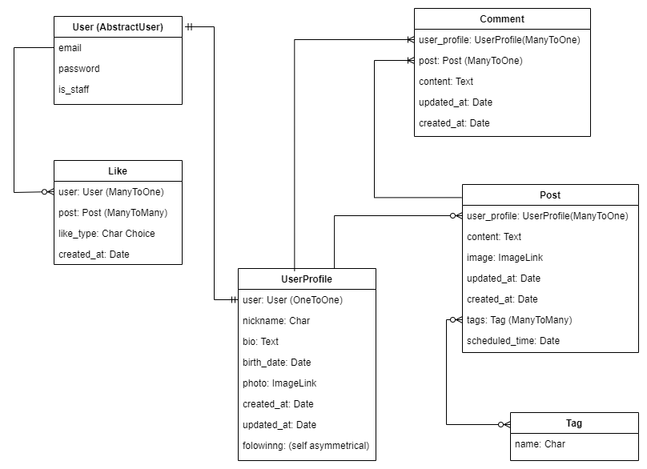

# Social Media API


App for publishing, read, discuss posts.

## Mission
This completely useless project for commercial purposes was created to practice developing API applications based on Django.

The second goal of this project is to demonstrate to future employers that I am capable of creating something more substantial than just 'Hello, world.'

## Technology Stack

- **Backend:** Python 3.12.7, Django 4.x, Django REST Framework
- **Database:** SQlite
- **Others:** JWT, Celery, Redis, Docker, Click, Pillow, PyYAML, psycopg2, pyflakes, pytz

## Description

This app was created to connect people and give them the opportunity to exchange their ideas.

In this app, you can:

- Create posts with some image.
- Like, dislike or ignore posts.
- Add comments with image to posts.
- Follow some authhors.
- Search posts by tags or authors.
- Schedule posts.


## Getting Started

These instructions will get you a copy of the project up and running on your local machine for development and testing purposes.

### Prerequisites

Must have:
- a computer with some operating system 
- some free time

### System Requirements

- Python 3.10
- pip (Python package installer)
- Docker


### Installing

A step by step series of examples that tell you how to get a development env running

1. Clone the repository:
    ```
    git clone the-link-from-forked-repo
    ```
2. Open the project folder in your IDE
   
3. If you are using PyCharm - it may propose you to automatically create venv for your project and install requirements in it, but if not:
    ```
    python -m venv venv
    venv\Scripts\activate (on Windows)
    source venv/bin/activate (on macOS)
    pip install -r requirements.txt
    ```
4. Run Redis with Docker and Celery worker for post scheduling.
    ```
    docker run -d -p 6379:6379 redis
    celery -A social_media worker -l INFO
    ```

5. Creating superuser:
    ```
    python manage.py createsuperuser
    ```

6. If you want use app like user:
    1. Register in app:
        ```
        /api/user/register/
        ```
    2. Get your token:
         ```
        /api/user/token/
        ```


## Permissions

    - Authorized users can read posts and like or dislike them.
    
    For more actions you have to create profile.
    
    - `/api/posts/profiles/create-profile/`
    
    Authorized users with profile can:
    - create posts (add images),
    - like, dislike posts,
    - add comments with image to posts,
    - follow/unfollow other users,
    - view profiles of other users.
  
    Only owners can update, delete posts and profiles.

## API Endpoints

Major endpoints for interacting with the application:

    Posts:
      - `/api/posts/posts/` - List of posts/add post.
      - `/api/posts/posts/<id>/` - Manage post.
      - `/api/posts/posts/<id>/like/` - Like/dislike post or nothing.
      - `/api/posts/posts/<id>/upload_image/` - Upload image for post.
      - `/api/posts/profiles/` - List of profiles/add profile.
      - `/api/posts/profiles/create-profile/` - Create profile.
      - `/api/posts/profiles/<id>/` - Manage profile.
      - `/api/posts/profiles/<id>/follow/` - Add profile to following.
      - `/api/posts/profiles/<id>/unfollow/` - Remove profile from following.
  
    User:
      - `/api/user/register/` - Register a new user .
      - `/api/booking-service/stations/` - Manage stations and their images.
      - `/api/user/token/` - Obtain token pair.
      - `/api/user/token/refresh/` - Actualize your access token with refresh token .
      - `/api/user/token/verify/` - Verify token if it is valid.
      - `api/user/me/` - Manage your profile details.
      - `api/user/logout/` - Logout (deactivate refresh token).
      
### Swagger API

- `/api/doc/swagger/`

### Redoc API

- `/api/doc/redoc/`

### DB Structure:

